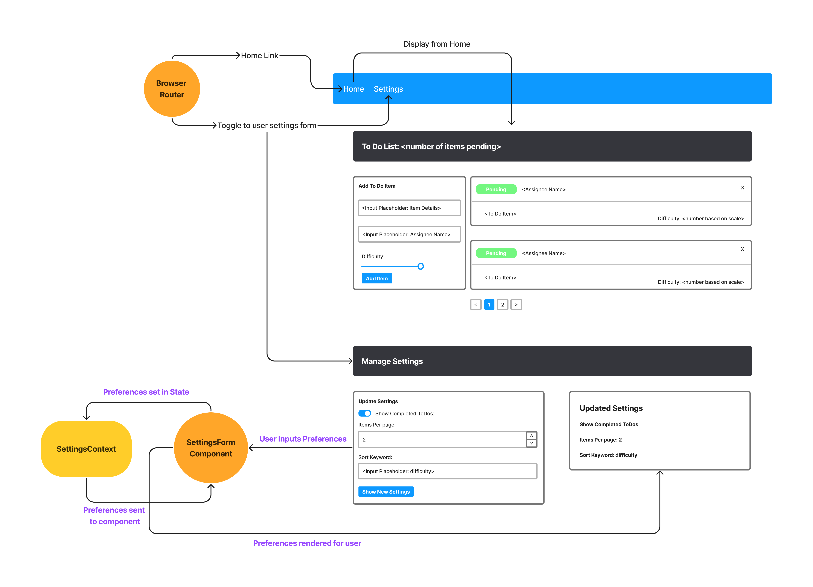

# ToDo App

## Author: Stephanie Hill

Links:

- [Code Sandbox](https://codesandbox.io/p/github/stephnitis/todo-app/main?file=%2FREADME.md&workspace=%257B%2522activeFileId%2522%253A%2522cl9yg92ma000rlsjhc22529os%2522%252C%2522openFiles%2522%253A%255B%2522%252FREADME.md%2522%255D%252C%2522sidebarPanel%2522%253A%2522EXPLORER%2522%252C%2522gitSidebarPanel%2522%253A%2522COMMIT%2522%252C%2522sidekickItems%2522%253A%255B%257B%2522type%2522%253A%2522PREVIEW%2522%252C%2522taskId%2522%253A%2522start%2522%252C%2522port%2522%253A3000%252C%2522key%2522%253A%2522cl9yg9n1n005j3b6hkfkf93sh%2522%252C%2522isMinimized%2522%253Afalse%252C%2522path%2522%253A%2522%252F%2522%257D%255D%257D)

## Phase One

### branch: context-settings

#### Technical Requirements

1. Implementation of React context API for defining settings across the entire application.

- Context for managing application display settings provided at the application level.
- Display and Hide completed items (boolean).
- Number of items to display per screen (number).

2. Consume and utilize context values throughout your components

- Shows a maximum of a certain number of items per screen in the `<List />` component
  - Uses the Mantine Pagination component to let the users navigate a long list of items
- Hide completed items in the list

#### Pagination Notes

- Only displays the first n items in the list, where n is the number to display per screen in your settings context.
- If you have more than n items in the list, the Pagination Component will add a button that, when clicked, will replace the list with the next n items in the list.
- the Pagination Component also manages the previous (<) and next(>) arrow buttons.

## Phase Two

### branch: context-methods

1. Implemented the Context API to make some basic application settings available to components

- How many To Do Items to show at once
- Whether or not to show completed items

2. Provided the users with a form where they can change the values for those settings

- Implemented in the form of a new component, linked to the main navigation through a React Router

3. User preferences are saved to Local Storage, and applied on application start-up

References:

- [Demo Code](https://github.com/codefellows/seattle-code-javascript-401d48)
- [Mantine Docs](https://mantine.dev/)
- [Storing User Preferences in React](https://dev.to/lrth06/storing-user-preferences-in-react-2g4i)
- [How to Use localStorage with React](https://www.freecodecamp.org/news/how-to-use-localstorage-with-react-hooks-to-set-and-get-items/)
- [How to persist data to localStorage in React with hooks](https://dev.to/gautham495/how-to-persist-data-to-localstorage-in-react-with-hooks-6ma)
- [How to Store a Javascript Array in localStorage](https://catalins.tech/store-array-in-localstorage/)