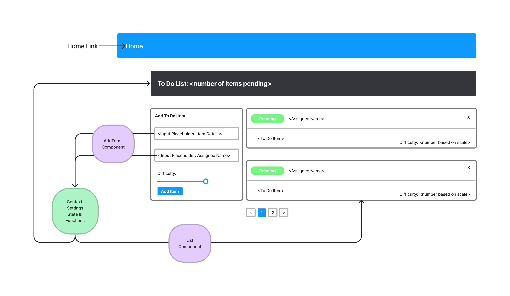

# ToDo App

## Author: Stephanie Hill

Links:

- [Code Sandbox](https://codesandbox.io/p/github/stephnitis/todo-app/draft/goofy-dream?file=%2FREADME.md&workspace=%257B%2522activeFileId%2522%253A%2522cl9ye3gxl000xlri0798d1bsr%2522%252C%2522openFiles%2522%253A%255B%2522%252FREADME.md%2522%255D%252C%2522sidebarPanel%2522%253A%2522EXPLORER%2522%252C%2522gitSidebarPanel%2522%253A%2522COMMIT%2522%252C%2522sidekickItems%2522%253A%255B%257B%2522key%2522%253A%2522cl9ye3inp000o3b6hkydwhpnz%2522%252C%2522type%2522%253A%2522PROJECT_SETUP%2522%252C%2522isMinimized%2522%253Afalse%257D%252C%257B%2522type%2522%253A%2522TASK_LOG%2522%252C%2522taskId%2522%253A%2522start%2522%252C%2522key%2522%253A%2522cl9ye3wzn004n3b6h1qh6pdwz%2522%252C%2522isMinimized%2522%253Afalse%257D%255D%257D)

## Phase One

### branch: context-settings

#### Technical Requirements

1. Implementation of React context API for defining settings across the entire application.

- Context for managing application display settings provided at the application level.
- Display and Hide completed items (boolean).
- Number of items to display per screen (number).

2. Consume and utilize context values throughout your components

- Shows a maximum of a certain number of items per screen in the `<List />` component
  - Uses the Mantine Pagination component to let the users navigate a long list of items
- Hide completed items in the list

#### Pagination Notes

- Only displays the first n items in the list, where n is the number to display per screen in your settings context.
- If you have more than n items in the list, the Pagination Component will add a button that, when clicked, will replace the list with the next n items in the list.
- the Pagination Component also manages the previous (<) and next(>) arrow buttons.

## Phase Two

### branch: context-methods

References:

- [Demo Code](https://github.com/codefellows/seattle-code-javascript-401d48)
- [Mantine Pagination Docs](https://mantine.dev/core/pagination/)